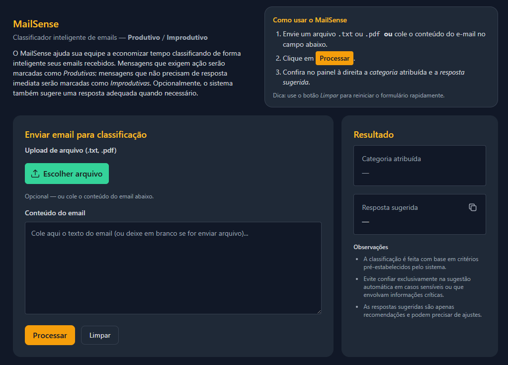

# MailSense | Email Classifier Application

A comprehensive solution for automated email classification and response generation designed for high-volume email processing in enterprise environments. This application leverages AI to automatically categorize incoming emails and generate appropriate responses, significantly reducing manual processing time.


## Features

- **Intelligent Email Classification**: Automatically categorizes emails into productive and non-productive types
- **AI-Powered Response Generation**: Generates contextually appropriate responses using Google's Gemini AI
- **Multi-Format Support**: Processes both text content and file uploads (PDF, TXT)
- **RESTful API**: FastAPI backend with comprehensive documentation
- **Modern Web Interface**: Angular-based frontend with responsive design
- **Containerized Deployment**: Docker support for easy deployment and scaling

## Architecture

- **Backend**: FastAPI (Python) with Google Gemini AI integration
- **Frontend**: Angular 19 with PrimeNG components and TailwindCSS
- **Containerization**: Docker with Docker Compose orchestration
- **File Processing**: Support for PDF and text file extraction

## Prerequisites

- Docker and Docker Compose installed
- Google Gemini API key (for AI classification and response generation)

## Quick Start

### 1. Clone the Repository

```bash
git clone <repository-url>
cd email-classifier-app
```

### 2. Environment Configuration

Create a `.env` file in the `backend` directory:

```bash
cd backend
cp .env.example .env
```

Edit the `.env` file with your configuration:

```env
GEMINI_API_KEY=your_gemini_api_key_here
```

### 3. Run with Docker Compose

From the project root directory:

```bash
docker-compose up --build
```

This will:
- Build and start the backend API on port 8000
- Build and start the frontend application on port 80
- Set up the complete application stack

### 4. Access the Application

- **Frontend**: http://localhost
- **Backend API Documentation**: http://localhost:8000/docs
- **Backend API Alternative Docs**: http://localhost:8000/redoc

## Manual Setup (Development)

### Backend Setup

1. Navigate to the backend directory:
```bash
cd backend
```

2. Create and activate a virtual environment:
```bash
python -m venv venv
source venv/bin/activate  # On Windows: venv\Scripts\activate
```

3. Install dependencies:
```bash
pip install -r requirements.txt
```

4. Set up environment variables:
```bash
cp .env.example .env
# Edit .env file with your Gemini API key
```

5. Run the backend server:
```bash
uvicorn app.main:app --reload --host 0.0.0.0 --port 8000
```

### Frontend Setup

1. Navigate to the frontend directory:
```bash
cd frontend
```

2. Install Node.js dependencies:
```bash
npm install
```

3. Start the development server:
```bash
ng serve
```

4. Access the application at http://localhost:4200

## API Endpoints

### POST /classify-email-content/
Classifies email content provided as text.

**Request Body:**
```json
{
  "text": "Email content to be classified"
}
```

**Response:**
```json
{
  "category": "Productive|Non-productive",
  "reply": "Generated response text"
}
```

### POST /classify-email-file-content/
Classifies email content from uploaded files (PDF or TXT).

**Request:** Multipart form data with file upload

**Response:**
```json
{
  "category": "Productive|Non-productive",
  "reply": "Generated response text"
}
```

## Project Structure

```
email-classifier-app/
├── backend/                 # FastAPI backend application
│   ├── app/
│   │   ├── models/         # Pydantic models for request/response
│   │   ├── services/       # Business logic and AI integration
│   │   ├── utils/          # Utility functions for file processing
│   │   └── main.py         # FastAPI application entry point
│   ├── Dockerfile          # Backend container configuration
│   └── requirements.txt    # Python dependencies
├── frontend/               # Angular frontend application
│   ├── src/
│   │   ├── app/           # Angular components and services
│   │   └── environments/  # Environment configurations
│   ├── Dockerfile         # Frontend container configuration
│   └── package.json       # Node.js dependencies
├── examples/              # Sample email files for testing
└── docker-compose.yml     # Multi-container orchestration
```

## Usage

1. **Web Interface**: Upload email files or paste email content directly into the web interface
2. **API Integration**: Use the REST API endpoints for programmatic access
3. **File Processing**: Supports PDF and TXT file uploads for email content extraction

## Screenshot

Below is a screenshot of the application running. Open `print.png` in the project root if the image does not display.



## Testing

Use the provided example files in the `examples/` directory to test the classification functionality:
- `email_produtivo.pdf` - Example of productive email
- `email_improdutivo.txt` - Example of non-productive email

## Environment Variables

| Variable | Description | Required |
|----------|-------------|----------|
| `GEMINI_API_KEY` | Google Gemini API key for AI processing | Yes |

## Troubleshooting

### Common Issues

1. **API Key Issues**: Ensure your Gemini API key is correctly set in the `.env` file
2. **Port Conflicts**: If ports 80 or 8000 are in use, modify the docker-compose.yml accordingly
3. **File Upload Issues**: Check file size limits and supported formats (PDF, TXT)

### Logs

View application logs:
```bash
docker-compose logs backend
docker-compose logs frontend
```

## Contributing

1. Fork the repository
2. Create a feature branch
3. Make your changes
4. Test thoroughly
5. Submit a pull request

## License

This project is licensed under the MIT License. See the [LICENSE](LICENSE) file for details.
